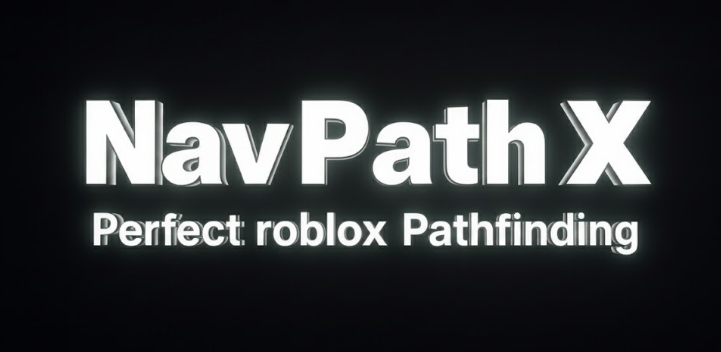

<p align="center">
  
</p>
<h1 align="center">NavPathX</h1>

- A forked and optimized version of the pathfinding tool called [SimplePath](https://github.com/grayzcale/simplepath).
- Documentation [here](https://github.com/elcapykkzxd/NavPathX/blob/main/Docs.md)
## Credits:
- [GrayzcaIe](https://github.com/grayzcale)
  - SimplePath Creator.

- [elcapykkzxd](https://github.com/elcapykkzxd)
  - NavPathX Owner & Creator.

- [Asdfyc123](https://www.roblox.com/users/3669138152/profile)
  - NavPathX Contributor.

- [boydev1444](https://github.com/boydev-1444)
  - NavPathX Contributor.
  - Teached how to make smart pathfinding systems.

## Initialization
- As a "fork" of SimplePath, the function names got renamed.
- Initialization is below this message.
```lua
local NavPathX = require("@self/NavPathX") -- Or "NavPathX.lua(u)?"
local path = NavPathX.SetSettings( 
    Model: <Instance: Model>,  -- Pathfinding Agent.
    agentParameters <table?: {[string]: any}>, -- Default agent parameters.
    VisualizePathfinding: <boolean?: true/false>  -- If visualize the Pathfinding operations.
) :: <table { -- Must be called in a path namecall (path:NAMECALL())
   path:Destroy: function, -- Destroys the Path.
   path:Stop: function, -- Stops the current Pathfinding.
   path:Run: function, -- Begins Pathfinding to goal.
}>

```
## Available on Roblox Creator Store:
- [**NavPathX - Smart Pathfinding Module**](https://create.roblox.com/store/asset/105782363313225/NavPathX-Smart-Pathfinding-Module)
